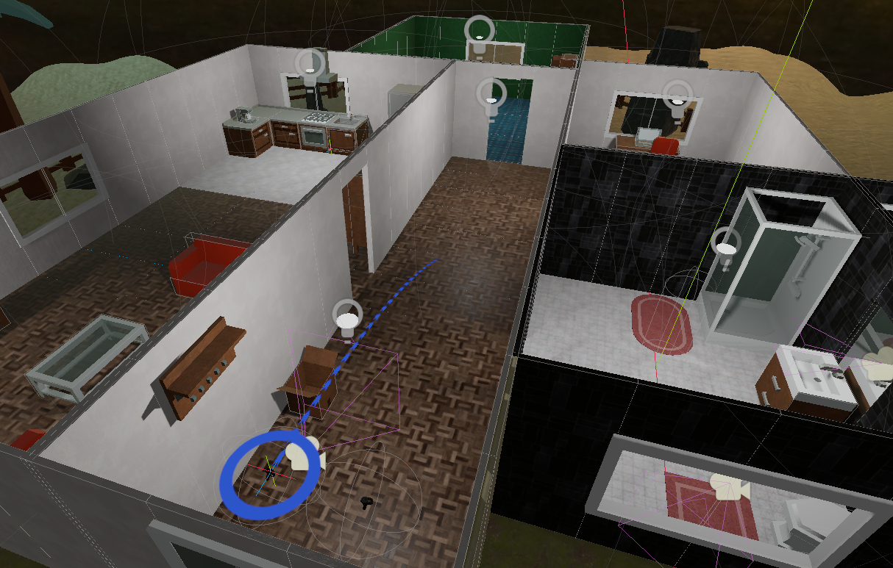

Godot Object Interaction in VR
==============================

This repository contains the source code of the demo project used for the Object Interaction in VR tutorial series I have on my Youtube channel.

You can find those here:
- [Part one](not yet available)

License
-------
All code and project files you find in this repository are MIT licensed. See LICENSE

The files contained in the `assets` and `addons` subfolders are from 3rd parties, license details are included within these subfolders.

About this repository
---------------------
This repository was created by and is maintained by Bastiaan Olij a.k.a. Mux213

You can follow me on twitter for regular updates here:
https://twitter.com/mux213

Videos about my work with Godot can by found on my youtube page:
https://www.youtube.com/BastiaanOlij

Support my work by becoming my Patreon:
https://www.patreon.com/mux213
